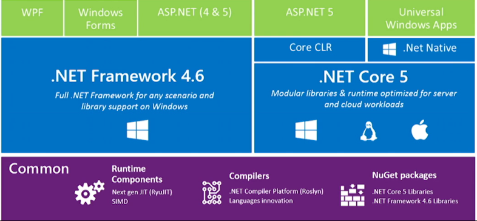

Visual studio :
	 ## shortcut ##
		Ctrl -  / Ctrl Shift - : previous / next
		Ctrl F12 : goto implem
		Ctrl R Ctrl A : run all test
		CTRL K Ctrl K : create waypoint
		CTRL K Ctrl P : navigate to last waypoint
		CTRL R CTRL R : rename
	## Snippet ##
	ctor
	testm
	... + customisable et partageable.

Csharp

concept en 2 mots :

le CLR (langage intermediaire) fais parti des choses inclus dans .net
.Net * c'est des library utilisables par tous les langage transpilable en CLR (C#, VB, F# ...)

enfin on a la version du langage. donc C# 10 par exemple ne peux pas tourner sur 4.8 mais C# 1 pourrait tourner sur .Net 8.

depuis 3.1 .Net Core est appeler .Net
enfin .Net Standard est le common entre 4.8, core, xamarin, mono, unity ... (plus petite partie commune) donc tres limite par definition. devrais disparaitre :fingercrossed:

(asp .net : juste un framework pour faire du web)
